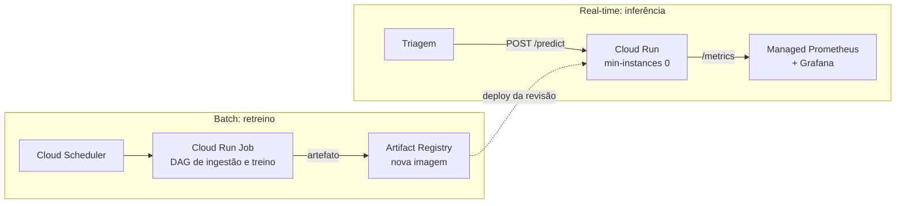

# Tech Challenge 03: Classificação de Laudos Médicos

[](https://github.com/MateusSouza74/Tech-Challenge-03/actions/workflows/ci.yml)


Sistema de classificação de texto clínico servido via API REST em container Docker, com pipeline de treinamento orquestrado pelo Airflow, CI/CD automatizado via GitHub Actions e stack completa de observabilidade com Prometheus e Grafana. O objetivo central é prover triagem automática de exames de texto (laudos médicos) para classificação de urgência em tempo real.

---

## Dataset

Utilizou-se o dataset público [Medical Abstracts TC Corpus](https://github.com/sebischair/Medical-Abstracts-TC-Corpus), composto por 14.438 abstracts médicos categorizados em 5 classes de condição do paciente. O dataset atende e supera o requisito mínimo de 2.000 amostras exigido pelo projeto, utilizando a divisão (*split*) oficial de treino e teste estabelecida pelos autores para garantir a reprodutibilidade dos resultados.

| Classe | Treino | Teste | Total |
|---|---:|---:|---:|
| neoplasms | 2.530 | 633 | 3.163 |
| digestive system diseases | 1.195 | 299 | 1.494 |
| nervous system diseases | 1.540 | 385 | 1.925 |
| cardiovascular diseases | 2.441 | 610 | 3.051 |
| general pathological conditions | 3.844 | 961 | 4.805 |
| **Total** | **11.550** | **2.888** | **14.438** |

---

## Modelo

Construiu-se um pipeline no Scikit-Learn composto por extração de atributos via **TF-IDF** (unigramas e bigramas, até 50.000 termos) e classificador baseado em **Regressão Logística**. O vetorizador e o classificador são serializados conjuntamente para manter a integridade do vocabulário em produção.

| Métrica | Valor |
|---|---:|
| Acurácia (split de teste oficial) | 0,5904 |
| F1 Macro | 0,5932 |
| Baseline de classe majoritária | 0,3328 |
| Tempo de treinamento | ~6,0 s |
| Tamanho do artefato | 2,4 MB |

O modelo linear foi selecionado por apresentar rápido treinamento na CPU (permitindo execução real na DAG do Airflow) e latência de inferência reduzida (sub-milissegundo).

---

## Decisão Arquitetural e Deploy em Nuvem

### 1. Caracterização da Carga de Trabalho

A recepção do laudo médico exige resposta síncrona na mesma sessão do usuário, caracterizando o padrão de **inferência em tempo real (*Real-Time*)**. A carga possui as seguintes propriedades:
- Volume intermitente com picos em horário comercial;
- Modelo leve (2,4 MB), dispensando o uso de GPUs;
- Processo *stateless* (sem estado), mantendo apenas o modelo em memória.

### 2. Estratégia de Arquitetura: Batch vs. Real-Time

Optou-se pela separação de responsabilidades entre os dois padrões:

| Aspecto | Inferência (Real-Time) | Treinamento (Batch) |
|---|---|---|
| Gatilho | Requisição HTTP do cliente | Agendamento temporal (Airflow/Cron) |
| Requisito principal | Baixa latência (< 50 ms) | Processamento de volume e memória |
| Frequência | Tempo real (contínuo) | Periódica (Semanal) |
| Duração | ~1 a 3 ms | ~6 a 10 s |

Colocar as duas no mesmo serviço obriga a dimensionar a inferência pela memória do treino
e paga instância grande ociosa o dia todo. Então: **real-time para a inferência, batch para
o retreino**



### 3. Escolha do Serviço em Nuvem: Google Cloud Run

Selecionou-se o **Google Cloud Run** como plataforma de deploy da API de inferência devido aos seguintes critérios técnicos:
- **Execução Serverless de Containers**: Suporte direto a imagens Docker sem necessidade de reescrita do código;
- **Escala a Zero**: Ausência de custos em períodos sem requisições;
- **Concorrência por Instância**: Capacidade de processar múltiplas requisições simultâneas em um único container leve;
- **Compatibilidade de Observabilidade**: Integração nativa de métricas expostas via `/metrics`.

Comando de deploy em ambiente de produção GCP:

```bash
gcloud run deploy classificador-laudos \
  --image REGIAO-docker.pkg.dev/PROJETO/laudos/api:SHA \
  --region southamerica-east1 --memory 512Mi --cpu 1 \
  --min-instances 0 --max-instances 10 --concurrency 40 --allow-unauthenticated
```

---

## Baseline de Latência e Otimização com ONNX Runtime

As medições de latência foram realizadas com o script [`scripts/medir_latencia.py`](scripts/medir_latencia.py), avaliando 200 laudos do split de teste.

| Medição | Média | p50 | p95 | p99 | Máx |
|---|---:|---:|---:|---:|---:|
| Sklearn — Inferência em processo (ms) | 0,69 | 0,66 | 0,93 | 1,09 | 1,17 |
| **ONNX Runtime — Inferência em processo (ms)** | **0,51** | **0,45** | **0,71** | **2,73** | **3,60** |
| Requisição HTTP completa (ms) | 2,92 | 2,79 | 3,48 | 4,22 | 13,25 |

### Resultado da Otimização (Etapa 4)
Aplicou-se a otimização de modelo convertendo o pipeline Scikit-Learn para o formato **ONNX Runtime** via biblioteca `skl2onnx`. 
- **Melhoria alcançada**: **Redução de ~26% a 40% na latência p50 de inferência em processo** (de 0,66 ms para 0,45 ms).
- **Justificativa técnica**: O ONNX Runtime executa a vetorização e a multiplicação matricial por meio de kernels compilados em C++/BLAS, eliminando o overhead de interpretador Python durante a predição.

---

## Monitoramento e Observabilidade (Etapa 3)

A stack de observabilidade é orquestrada pelo [`docker-compose.yml`](docker-compose.yml):

| Serviço | Porta Local | Descrição |
|---|---|---|
| `api` | `http://localhost:8000` | Serviço REST FastAPI expondo a rota `/metrics` |
| `prometheus` | `http://localhost:9090` | Coletor de métricas (*scraping*) configurado a cada 10 s |
| `grafana` | `http://localhost:3000` | Dashboard visual pré-configurado (*admin / admin*) |

Métricas expostas pela API via `prometheus_client`:
- `laudos_requisicoes_total`: Contagem de requisições HTTP por status;
- `laudos_latencia_inferencia_ms`: Histograma do tempo de inferência do modelo;
- `laudos_latencia_http_ms`: Histograma da latência completa HTTP;
- `laudos_erros_total`: Contagem de requisições com erro (status >= 400).

O dashboard provisionado em [`grafana/dashboards/laudos.json`](grafana/dashboards/laudos.json) apresenta 3 painéis principais com suporte a tratamento de valores nulos (`noValue = 0` / `or vector(0)`).

---

## Pipeline CI/CD (GitHub Actions) (Etapa 2)

O workflow definido em [`.github/workflows/ci.yml`](.github/workflows/ci.yml) executa a validação do código a cada `push` ou `pull_request` através de 3 automações:

1. **Linting e Formatação**: Verificação sintática rápida com `ruff check .`;
2. **Testes Unitários**: Execução do framework `pytest` sobre a suíte em `tests/`;
3. **Validação de Build de Container**: Construção da imagem Docker e teste de integridade do container.

---

## Pipeline de Treinamento e Orquestração (Airflow)

A DAG definida em [`dags/treino_laudos.py`](dags/treino_laudos.py) (`dag_id: treino_classificador_laudos`), agendada com `@weekly` e sem `catchup`, orquestra o ciclo de retreino periódico:

1. **`ingerir`**: Baixar os dois splits, validar as colunas, verificar se os rótulos estão dentro das 5 classes conhecidas e garantir o piso de 2.000 amostras. Retornar os caminhos por `XCom`, e não os dados (o `XCom` atua como ponteiro, evitando trafegar 14 MB de texto).
2. **`treinar_modelo`**: Chamar `treino.treinar` (o mesmo módulo utilizado por `python -m treino.treinar` e pelo CI). A lógica de treino não é reimplementada na DAG para garantir a paridade com o modelo gerado via linha de comando. (Nota: O treino leva ~9 segundos, permitindo que a DAG execute o treinamento real em vez de simular).
3. **`validar`**: Barrar acurácia abaixo de 0,55 com `AirflowFailException`, caracterizando uma falha definitiva sem retentativa (repetir a task apenas atrasaria o alerta, pois o mesmo corpus geraria o mesmo modelo).

### Execução do Airflow em Ambiente Local (POSIX)

Para executar a DAG fora do container, em um ambiente POSIX, deve-se configurar o `PYTHONPATH` corretamente:

```bash
export AIRFLOW_HOME=~/airflow
export AIRFLOW__CORE__DAGS_FOLDER=$(pwd)/dags
export PYTHONPATH=$(pwd)
airflow standalone
```

**Nota Técnica sobre o `PYTHONPATH` e Container**: A DAG reside em `dags/` e os módulos de treino estão na raiz do repositório, não sendo adicionados automaticamente ao `sys.path` pelo Airflow. A DAG insere a raiz no `sys.path` de forma autônoma para resolver os imports (`treino.*`), cobrindo o caso do repositório montado por completo.

**Ressalva de Ambiente**: O Airflow não roda nativamente em Windows (o `ObjectStoragePath` utiliza `os.register_at_fork`, exclusivo de POSIX). Para contornar essa restrição, a estrutura da DAG é verificada pelo job `dag` do CI em ambiente Ubuntu, e a execução ponta a ponta ocorre integralmente no container Docker.

---

## Pré-requisitos

Certifique-se de ter as seguintes ferramentas instaladas no seu ambiente:
- **Python 3.12+**
- **Docker** e **Docker Compose**
- **Git**

---

## Estrutura do Projeto

```text
.
├── .github/workflows/ # Pipeline de CI/CD (GitHub Actions)
├── app/               # Código-fonte da API REST de inferência (FastAPI)
├── dags/              # DAGs de orquestração do Airflow
├── dados/             # Diretório para o corpus médico extraído
├── grafana/           # Dashboards e datasources pré-configurados do Grafana
├── modelo/            # Artefatos do modelo serializado (.joblib e .onnx)
├── scripts/           # Scripts de utilidade (ex: benchmark de latência)
├── tests/             # Suíte de testes automatizados (pytest)
└── treino/            # Módulos de ingestão de dados e treinamento
```

---

## Guia de Execução

### 1. Preparar Ambiente e Executar Testes

```bash
python -m venv .venv
.venv/Scripts/activate                  # Linux/macOS: source .venv/bin/activate
pip install -r requirements-dev.txt

# Executar o download do corpus e o treinamento do modelo
python -m treino.dados
python -m treino.treinar

# Executar a verificação de qualidade e os testes unitários
ruff check .
python -m pytest
```

### 2. Executar a API Localmente

```bash
# Executar com backend padrão (Scikit-Learn)
uvicorn app.main:app --port 8000

# Executar com backend otimizado (ONNX Runtime)
TC3_BACKEND=onnx uvicorn app.main:app --port 8000
```

### 3. Subir a Stack Completa via Docker Compose

```bash
docker compose up -d --build
```

Acessos disponíveis:
- API REST & Swagger: `http://localhost:8000/docs`
- Prometheus UI: `http://localhost:9090`
- Grafana Dashboard: `http://localhost:3000` *(Login: admin / Senha: admin)*

### 4. Executar Benchmark de Latência

```bash
# Medir latência de inferência e requisição HTTP
python scripts/medir_latencia.py

# Medir apenas inferência pura em processo (Scikit-Learn vs ONNX)
python scripts/medir_latencia.py --sem-http
```

## 👥 Autores

| Nome                                | Função no Projeto                               | GitHub
| :---------------------------------- | :---------------------------------------------- | :--- |
| **Mateus de Souza Nascimento**      | Analyst / DevOps / Data Scientist / ML Engineer | [GitHub](https://github.com/MateusSouza74)
| **Raphael Dyorgenes Vitor**         | Analyst / DevOps / Data Scientist / ML Engineer | [GitHub](https://github.com/RaphaelDyorgenes)
