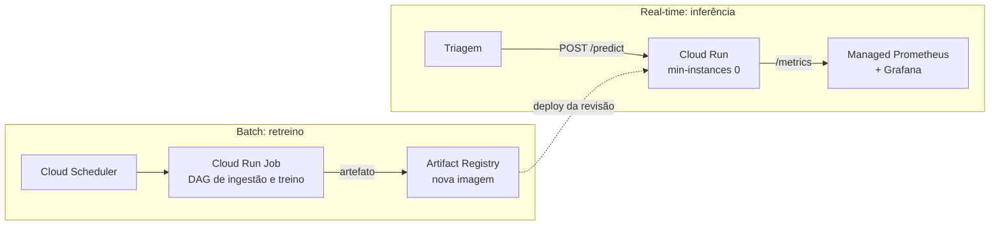

# Tech Challenge 03: classificação de laudos médicos

Classificador de texto clínico servido por API, empacotado em container, com pipeline de
treino orquestrado, CI automatizado e stack de observabilidade. O caso de uso é triagem:
o laudo chega, e a resposta com a categoria da condição volta na mesma sessão do usuário.

## Dataset

[Medical Abstracts TC Corpus](https://github.com/sebischair/Medical-Abstracts-TC-Corpus):
14.438 abstracts médicos rotulados em 5 classes de condição do paciente. Bem acima do
mínimo de 2.000 amostras pedido pelo desafio, e com o split de treino e teste já definido
pelos autores, o que evita discussão sobre vazamento de dados na avaliação.

| Classe | Treino | Teste | Total |
|---|---:|---:|---:|
| neoplasms | 2.530 | 633 | 3.163 |
| digestive system diseases | 1.195 | 299 | 1.494 |
| nervous system diseases | 1.540 | 385 | 1.925 |
| cardiovascular diseases | 2.441 | 610 | 3.051 |
| general pathological conditions | 3.844 | 961 | 4.805 |
| **Total** | **11.550** | **2.888** | **14.438** |

## Modelo

TF-IDF (unigrama e bigrama, 50.000 termos) mais regressão logística, num `Pipeline` único
do scikit-learn. Vetorizador e classificador viajam juntos porque servir o modelo com
vocabulário de outra versão prediz sem erro nenhum e com resultado errado.

| Métrica | Valor |
|---|---:|
| Acurácia (split de teste oficial) | 0,5904 |
| F1 macro | 0,5932 |
| Piso da classe majoritária | 0,3328 |
| Tempo de treino | 8,9 s |
| Tamanho do artefato | 2,4 MB |

O número tem que ser lido contra o piso: chutar sempre a classe mais frequente acerta
33%, e o modelo acerta 59% em 5 classes. O relatório por classe em
[`modelo/metricas.json`](modelo/metricas.json) mostra onde ele sofre, e é coerente com o
corpus: `general pathological conditions` é uma classe guarda-chuva e fica com F1 0,419,
enquanto `neoplasms`, que tem vocabulário próprio, chega a 0,716. A escolha de um modelo
linear é deliberada: treina em segundos, o que faz a DAG do Airflow treinar de verdade em
vez de simular, e infere em fração de milissegundo na CPU.

## Arquitetura de deploy em nuvem

### 1. Como é a carga, antes de escolher qualquer serviço

O laudo chega na triagem e a resposta precisa voltar na mesma sessão do usuário. Isso
define **inferência síncrona**, não um lote noturno. Além disso:

- volume baixo e intermitente, concentrado no horário comercial, com longos períodos de
  zero requisição;
- o modelo tem 2,4 MB e infere em 0,76 ms de p50 na CPU, então GPU seria desperdício puro
  e uma instância pequena resolve;
- o processo é stateless: nada de sessão, nada de banco, o único estado é o artefato lido
  na subida.

### 2. Batch ou real-time? Os dois, em serviços diferentes

Não é escolha excludente, e tratar como se fosse é o erro mais comum aqui. O projeto tem
duas cargas com requisitos opostos:

| | Inferência | Treino |
|---|---|---|
| Gatilho | requisição do usuário | agendamento |
| Requisito | latência de milissegundos | throughput e memória |
| Frequência | intermitente, o dia todo | semanal |
| Duração | 3 ms | 9 s hoje, minutos quando o corpus crescer |
| Se cair | usuário vê erro na hora | ninguém percebe até o próximo deploy |

Colocar as duas no mesmo serviço obriga a dimensionar a inferência pela memória do treino
e paga instância grande ociosa o dia todo. Então: **real-time para a inferência, batch para
o retreino**.



### 3. Escolha: Google Cloud Run

| Critério | Por que o Cloud Run atende |
|---|---|
| Sem reescrita | o entregável já é um container que escuta numa porta, e o Cloud Run roda ele como está, lendo a porta de `$PORT` |
| Custo em ociosidade | escala a zero, e fora do horário comercial a conta é zero |
| Gratuidade | a cota permanente (2 milhões de requisições, 180 mil vCPU-s e 360 mil GiB-s por mês) cobre este projeto inteiro |
| Cold start aceitável | subir o uvicorn e ler 2,4 MB de joblib fica na casa de 1 a 2 s, tolerável numa triagem; se o SLA apertar, `min-instances=1` resolve ao custo de sair da cota gratuita |
| Concorrência | a inferência custa 0,76 ms de CPU, então concorrência alta por instância amortiza bem e uma instância sozinha absorve o pico |
| Observabilidade | o `/metrics` da etapa 3 é raspado pelo Managed Service for Prometheus, com o mesmo dashboard do Grafana local |

**Onde fica o artefato.** Embutido na imagem, e não lido do Cloud Storage na subida. Assim
cada revisão do Cloud Run é um par imutável de código e modelo, e voltar atrás é apontar
para a revisão anterior. Ler do Storage só se paga quando o retreino é mais frequente que
o deploy, o que não é o caso de um retreino semanal.

**Como o deploy acontece.** GitHub Actions constrói a imagem, publica no Artifact Registry
e chama `gcloud run deploy`, autenticando por Workload Identity Federation, sem chave de
service account estática no repositório.

```bash
gcloud run deploy classificador-laudos \
  --image REGIAO-docker.pkg.dev/PROJETO/laudos/api:SHA \
  --region southamerica-east1 --memory 512Mi --cpu 1 \
  --min-instances 0 --max-instances 10 --concurrency 40 --allow-unauthenticated
```

**Região.** `southamerica-east1` (São Paulo), porque 200 ms de ida e volta até
`us-central1` custariam quase 70 vezes a inferência inteira. Num serviço cujo p50 é 3 ms,
a distância física é o maior componente da latência percebida.

### 4. O que foi descartado, e por quê

- **AWS Lambda com imagem de container e Function URL.** A cota gratuita também é
  permanente e é a nuvem que eu já opero no dia a dia, mas o Lambda precisaria de um
  adaptador ASGI (Mangum ou o Lambda Web Adapter) entre o modelo de evento dele e o
  FastAPI, e aí o container que roda em produção deixa de ser o mesmo que roda no
  `docker compose up`. Pior: métrica de processo do `prometheus_client` não sobrevive a um
  runtime que morre entre invocações, porque contador e histograma vivem na memória do
  processo. Isso conflita de frente com a etapa 3.
- **AWS ECS Fargate atrás de um ALB.** É o desenho correto para tráfego constante e foi o
  meu primeiro candidato, mas o ALB é cobrado por hora só de existir, mesmo com zero
  requisição, e não tem cota gratuita. Para uma carga que fica horas em zero, é pagar
  disponibilidade que ninguém usa.
- **SageMaker ou Vertex AI Endpoint.** Trazem versionamento de modelo, testes A/B e
  monitoramento de drift, nada disso necessário para um joblib de 2,4 MB, e cobram
  endpoint ligado 24 horas. Overkill que custa caro.
- **EC2 ou Compute Engine.** Devolve patch de sistema, renovação de TLS e reinício após
  falha para a nossa mão, que é exatamente o trabalho que o serviço gerenciado elimina.
- **Azure Container Apps.** Equivalente técnico do Cloud Run, com cota gratuita parecida.
  A escolha entre os dois é preferência, e ficamos no Cloud Run por ser mais direto de
  deployar por linha de comando.

As cotas gratuitas citadas são as vigentes na escrita deste documento e mudam sem aviso.
Nada foi provisionado: esta etapa é uma decisão documentada, sem custo.

## Baseline de latência

Medido com `scripts/medir_latencia.py`, 200 laudos reais do split de teste, 20 requisições
de aquecimento descartadas, uvicorn local com um worker.

| Medição | média | p50 | p95 | p99 | máx |
|---|---:|---:|---:|---:|---:|
| Inferência em processo (ms) | 0,80 | 0,76 | 1,13 | 1,27 | 1,80 |
| Requisição HTTP completa (ms) | 2,92 | 2,79 | 3,48 | 4,22 | 13,25 |

Overhead de HTTP no p50: 2,03 ms. Throughput sequencial: 343 req/s.

As duas linhas são medidas separadas de propósito, e é essa separação que dá sentido à
etapa 4: **o modelo responde por 0,76 ms dos 2,79 ms da requisição**, ou 27% do total.
Otimizar o modelo mexe só nessa fatia, e um ganho de 1 ms nele desapareceria dentro do
número agregado se só o total HTTP fosse medido.

Ressalva honesta: a medição acima é com uvicorn nativo no Windows, **não dentro do
container**. A medição no container roda em outra máquina do time, que é quem cuida das
etapas de Docker, e entra aqui quando estiver feita.

## Como executar

```bash
python -m venv .venv
.venv/Scripts/activate                  # Linux e macOS: source .venv/bin/activate
pip install -r requirements-dev.txt

python -m treino.dados                  # baixa e valida o corpus
python -m treino.treinar                # treina, avalia e grava modelo/ e métricas

ruff check .
pytest

uvicorn app.main:app --port 8000        # sobe a API
```

Com a API de pé:

```bash
curl localhost:8000/health

curl -X POST localhost:8000/predict \
  -H 'content-type: application/json' \
  -d '{"texto":"Acute myocardial infarction with occlusion of the left anterior descending artery."}'
# {"classe":"cardiovascular diseases","classe_id":4,"confianca":0.8939,"latencia_ms":1.856}
# A primeira chamada após a subida sai perto de 11 ms: é a inicialização preguiçosa do
# numpy e do scipy, paga uma vez. O baseline abaixo descarta esse aquecimento.

python scripts/medir_latencia.py        # reproduz a tabela de baseline
```

Documentação interativa da API em `http://localhost:8000/docs`.

No container:

```bash
docker build -t classificador-laudos .
docker run --rm -p 8000:8000 classificador-laudos
```

Variáveis de ambiente: `TC3_DATA_DIR` e `TC3_MODEL_DIR` movem os diretórios de dados e do
artefato, que é o que permite a DAG do Airflow rodar em container com bind mount.

## Etapas do desafio

| Etapa | Entrega | Status |
|---|---|---|
| 1 | Decisão arquitetural, API FastAPI, container e baseline de latência | concluída |
| 2 | GitHub Actions com lint e testes, DAG de treino no Airflow | em andamento |
| 3 | Docker Compose com Prometheus e Grafana, dashboard de métricas | a fazer |
| 4 | Otimização de latência do modelo e comparação com o baseline | a fazer |
